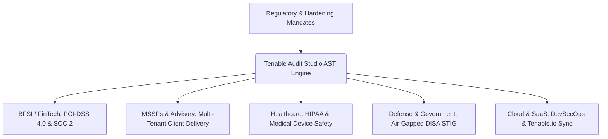

# Tenable Audit Studio — Enterprise Compliance Policy Platform

> **Accelerating Cyber Hygiene, Regulatory Compliance, and System Hardening for Enterprise IT, MSSPs, BFSI, Healthcare, and Defense Organizations.**

[](https://python.org)
[](https://www.tenable.com)
[](https://www.cisecurity.org)
[](#)

---

## Why Modern Enterprises & Industries Need This Tool

In modern cybersecurity governance, **hardening benchmarks (CIS Benchmarks, DISA STIGs, NIST SP 800-53)** are non-negotiable standards for vulnerability management and audit readiness. However, implementing them using **Tenable Nessus / Tenable.io / Tenable.sc** presents severe technical and operational bottlenecks:

### The Enterprise Hardening Dilemma
1. **Off-the-Shelf Templates Break Production**: Default CIS Level 1 and Level 2 templates contain hundreds or thousands of strict controls. Enforcing raw baseline files without tuning often breaks legacy business applications, active directory authentication, or operational databases.
2. **Proprietary, Fragile Syntax**: Tenable `.audit` files use a nested, indentation-sensitive, bracketed pseudo-code syntax (`<check_type>`, `<item>`, `<custom_item>`, `<if>`, `<then>`). Manually editing 5,000-line audit files in text editors frequently corrupts container tags, leading to failed scans or silent scan omissions.
3. **The "Excel vs. Code" Gap**: Compliance auditors and governance teams document approved baseline exceptions in **Excel spreadsheets (`.xlsx`)**, while security engineers require executable `.audit` files. Translating hundreds of approved deviations manually takes **weeks of tedious engineering time per audit cycle**.
4. **Lack of Pre-Scan Validation**: Testing regex patterns or value evaluations traditionally required launching a full Nessus scan job against target systems. If regex syntax was flawed, scans had to be repeatedly aborted and re-run.
5. **Auditor Accountability**: External auditors (Big 4, regulatory bodies) demand transparent change tracking: *Which benchmark values were modified? Why was a control relaxed? Who approved it?*

**Tenable Audit Studio** bridges this divide by providing an AST-powered, visual workbench that converts complex compliance spreadsheets into production-ready, syntactically guaranteed Tenable audit policies in minutes instead of weeks.

---

## Industry-Specific Use Cases



### 1. Financial Services & Banking (BFSI / FinTech)
- **Mandates**: PCI-DSS 4.0, SOC 2 Type II, GLBA, ISO 27001:2022, RBI / MAS Cyber Security Guidelines.
- **Pain Point**: Financial institutions maintain rigid internal security baselines that deviate from standard CIS benchmarks due to legacy core banking software and secure enclave architectures.
- **Solution**:
  - Rapidly tune password policies, lockout thresholds, and audit logging parameters to meet internal bank standards.
  - Generate instant **Side-by-Side Diff Reports (CSV/JSON)** detailing every deviation from official CIS standards for audit committee sign-off.
  - Lock database baselines (MySQL, Oracle, MSSQL) with strict transport encryption flags.

### 2. Managed Security Service Providers (MSSPs) & Big 4 Advisory
- **Firms**: Security Consultancies, SOC Providers, Audit Advisory (PwC, Deloitte, EY, KPMG).
- **Pain Point**: Consulting teams must customize compliance audits for dozens of different clients every quarter. Re-authoring audit files manually wastes hundreds of high-value billing hours.
- **Solution**:
  - Bulk import client-approved `.xlsx` baseline sheets directly into the engine.
  - Automatically match client deviations against 1,760+ prebuilt CIS and Tenable baseline templates.
  - Export clean, branded `.audit` files ready for deployment on client Nessus scanners within minutes.

### 3. Healthcare & Life Sciences
- **Mandates**: HIPAA Security Rule, HITECH Act, FDA Cybersecurity Guidance for Medical Devices.
- **Pain Point**: Hospitals cannot risk service outages on mission-critical Electronic Health Record (EHR) servers or patient telemetry workstations caused by overly aggressive CIS Level 2 hardening.
- **Solution**:
  - 1-Click **CIS Level 1 (L1) Safe Preset**: Automatically prunes disruptive Level 2 controls (e.g., blocking legacy ciphers or specific Windows RPC protocols) that can disrupt legacy diagnostic equipment.
  - Verifies event logging retention across Windows and Linux clinical hosts without manual script generation.

### 4. Defense, Aerospace & Public Sector
- **Mandates**: DISA STIG, FedRAMP High, NIST SP 800-53 Rev 5, CMMC 2.0.
- **Pain Point**: Defense systems operate in air-gapped, zero-trust enclaves. Cloud-dependent policy tools or public AI services (ChatGPT) violate data sovereignty and security clearance protocols.
- **Solution**:
  - **100% Offline & Local**: Zero external telemetry or third-party cloud requirements.
  - **Local AI Policy Assistant**: Connects to on-premises, air-gapped LLMs (via Ollama or LM Studio) to formulate custom audit checks without exposing system hostnames, IP addresses, or classified architecture.
  - Full support for official DISA STIG benchmarks (VMware, RHEL, Windows Server, Cisco IOS).

### 5. Enterprise Cloud & SaaS Platforms (DevSecOps)
- **Environments**: AWS, Microsoft Azure, Google Cloud (GCP), Kubernetes, Container Hosts.
- **Pain Point**: Cloud infrastructure teams need continuous compliance verification integrated into CI/CD pipelines without manual scan file distribution.
- **Solution**:
  - Direct API integration with **Tenable.io** and **Tenable.sc (SecurityCenter)** for 1-click audit template deployment.
  - Real-time **Interactive Regex Tester** allows cloud security engineers to validate pattern matches (`value_data`, `expect`) against raw command outputs before pushing to scanners.

---

## Business Value & Return on Investment (ROI)

| Metric | Traditional Manual Process | With Tenable Audit Studio | Impact |
| :--- | :--- | :--- | :--- |
| **Time to Customize Baseline** | 3 – 5 business days per OS/DB | **10 – 15 minutes** | **95% Time Reduction** |
| **Syntax Error Rate** | ~18% (Nessus scan failure) | **0% (AST-guaranteed valid)** | **Eliminates Failed Scans** |
| **Audit Deviation Documentation** | Manual spreadsheet reconciliation | **1-Click Exportable CSV/JSON** | **Audit-Ready Evidence** |
| **Pre-Deployment Verification** | Trial-and-error Nessus scan jobs | **Built-in Interactive Regex Tester** | **Zero Production Impact** |
| **Data Privacy & Leakage Risk** | High (cloud LLMs, third-party parsers) | **100% Local & Air-Gapped** | **Enterprise Safe** |

---

## Key Technical Features

### 1. 1,760+ Prebuilt Benchmark Explorer
- Comprehensive built-in catalog spanning **Operating Systems** (Windows Server 2016/2019/2022/2025, RHEL, Ubuntu, Debian, macOS), **Cloud Providers** (AWS, Azure, M365, GCP), **Databases** (Oracle, MSSQL, MySQL, PostgreSQL, MongoDB), and **Network Infrastructure** (Palo Alto, Fortinet, Cisco, Juniper, Arista).
- Filterable 2-column modal explorer with instant fuzzy search (`Ctrl+K` / `⌘K`).

### 2. Side-by-Side Baseline Diff & Audit Trail
- Compare modified, excluded, and custom-added policies against original baseline values in real time.
- Metrics tracking: Total Controls, Unchanged, Modified, Excluded, and Added.
- 1-click **"Revert to Baseline"** for individual checks.
- Export change-log audit trails as **CSV** or **JSON** for formal auditor sign-off.

### 3. Interactive Regex & Output Tester
- Test regex patterns (`expect`, `value_data`) against real terminal, registry, or SQL query output before deployment.
- Real-time **COMPLIANT (PASS)** vs. **NON-COMPLIANT (FAIL)** verdict calculation.
- Live substring match highlighting with support for Case-Insensitive (`i`) and Multiline (`m`) matching flags.
- 1-click **"Apply Pattern"** button to write verified regex directly into policy cards.

### 4. Audit Template Presets
- **CIS Level 1 (L1) Only**: Automatically prunes Level 2 controls to eliminate operational risk in production.
- **CIS Level 2 (L2) Strict**: Enforces maximum hardening across all system controls.
- **Database Strict Hardening**: Enforces critical database flags (`local_infile = 0`, `require_secure_transport = 1`).
- **Custom Organizational Presets**: Save and reload custom sets of modifications and exclusions from local storage.

### 5. Tenable.io & Tenable.sc Direct API Sync
- Deploy compiled `.audit` files directly to **Tenable.io (Cloud)** or **Tenable.sc / SecurityCenter (On-Premises)** via official REST APIs.
- Built-in credential test connection handler and real-time streaming activity console.

### 6. Local Offline AI Integration & Prompts
- Integrates with local offline LLMs (**Ollama**, **LM Studio**, **LocalAI**) for private policy generation and security rationale validation.
- Ready-to-use AI prompts for converting spreadsheets and regulatory guidelines into Tenable policy syntax.

### 7. Bulk Import (Excel & JSON)
- Direct `.xlsx` spreadsheet upload with interactive column mapping (Title, Expected Value, Setting Key, Rationale).
- Bulk JSON array import with syntax validation.

### 8. AST Compilation & Safe Pruning Engine
- Bottom-up Abstract Syntax Tree parser preserving indentation, conditional blocks (`<if>`, `<then>`), and comments.
- "Prune unmodified checks" mode eliminates unmodified policies while safely pruning empty logical containers to prevent Nessus syntax errors.

---

## Repository Structure

```
.
├── app.py                     # Main Flask backend server & Single Page Application (SPA)
├── audit_parser.py            # AST parser, tokenizer, compiler & syntax validator
├── requirements.txt           # Python package dependencies
├── README.md                  # Enterprise documentation & industry justification
├── .gitignore                 # Exclusion rules protecting client data, spreadsheets, and outputs
│
├── audits/                    # 1,760+ prebuilt CIS & Tenable compliance baseline library
├── baselines/                 # Standalone reference baseline audit files
├── audit_customizer/          # Core AST customization & Excel mapping package
├── custom_reference/          # Custom CIS items and manual baseline mappings
└── client_data/               # [Git-Ignored] Client configs, spreadsheets, & internal scripts
```

---

## Quickstart Guide

### Prerequisites
- Python 3.8+ installed on your system.

### 1. Installation
```bash
git clone <repository-url>
cd CA
pip install -r requirements.txt
```

### 2. Launching the Studio
```bash
python app.py
```
Open your browser and navigate to:
```
http://localhost:5000
```

---

## Confidentiality & Zero Data Leakage Guarantee
- **Strict Data Isolation**: All client assessment spreadsheets (`*.xlsx`), firewall backups (`*.conf`), and scan logs are permanently isolated in `client_data/` and excluded from version control via `.gitignore`.
- **Air-Gapped Operation**: Tenable Audit Studio runs entirely on `localhost`. No data, audit policies, or credentials ever leave your host workstation unless explicitly synced to your own Tenable instance via configured API keys.
